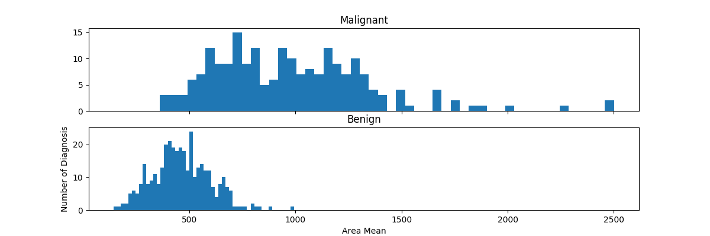
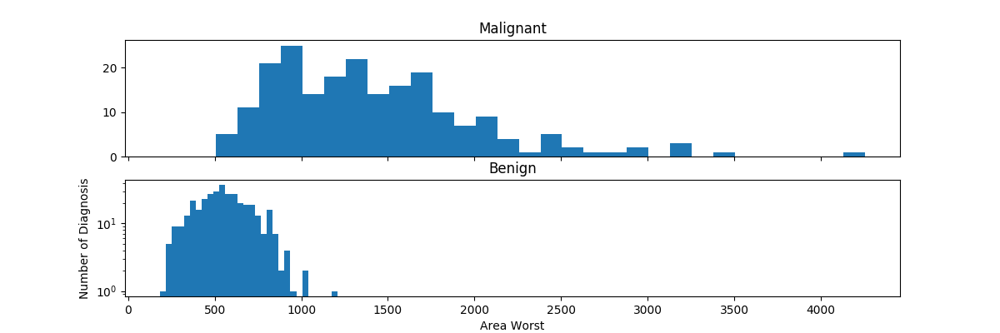
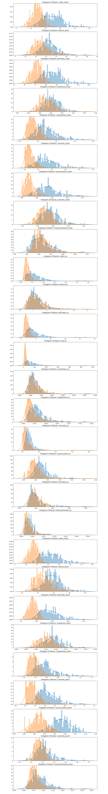
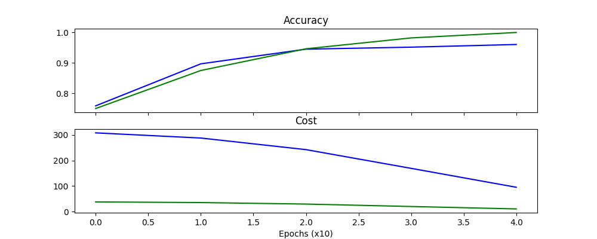

# Using Machine Learning to Predict Cancer in Mammograms with TensorFlow
An experiment with the use of TensorFlow used for predicting whether a tumor sample is benign or metastasized.

Original tutorial by [Arturo Guerrero](https://www.kaggle.com/arturogro) can be found [here](https://www.kaggle.com/arturogro/predict-breast-cancer-with-tensorflow?scriptVersionId=1540046).

This experiment uses the [Breast Cancer Wisconsin (Diagnostic) Dataset](https://www.kaggle.com/uciml/breast-cancer-wisconsin-data).


#### Area_Mean
The below graph shows the distribution of sample data comparing the area_mean across malignant and benign diagnosis.


The graph suggests that benign diagnosis have a normal distribution whereas malignant diagnosis are more uniformly distributed.

Given the distribution of malignant samples, the graph suggests that detection would be easier since the majority of samples exists above the 500 mark. 

#### Diagnosis_Worst
The graph below shows the distribution of sample data comparing the diagnosis_worst label across malignant and benign diagnosis.


There exist some similarities between this representation as well as the area_mean graph above.

#### Other Features
The graph below demonstrates the comparison of all the remaining features of the dataset.



## Results
The below graph demonstrates the prediction accuracy and cost after training the network. Results are recorded once every 10 epochs.



The prediction accuracy of the network on the current dataset holds at over 90%. With an average accuracy of 91% and valid accuracy of 96%.
Sample results after running the program can be seen below:

```
Epoch:  0   Accuracy:  0.84649   Cost:  305.33835   Valid Accuracy:  0.89286   Valid Cost:  37.34540
Epoch:  1   Accuracy:  0.90789   Cost:  281.78021   Valid Accuracy:  0.96429   Valid Cost:  34.34660
Epoch:  2   Accuracy:  0.93421   Cost:  238.87416   Valid Accuracy:  0.98214   Valid Cost:  28.73949
Epoch:  3   Accuracy:  0.93421   Cost:  179.49176   Valid Accuracy:  0.96429   Valid Cost:  20.79158
Epoch:  4   Accuracy:  0.94737   Cost:  122.69955   Valid Accuracy:  0.98214   Valid Cost:  12.74732
```

This experiment was designed to test the application of machine learning to real-world data. The results, whilst not perfect, demonstrate the capability of the neural network to predict (with a respectable degree of accuracy) the likelihood of a given mammogram showing signs of malignant tumors.  